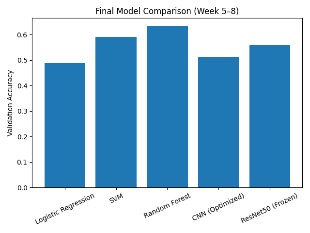
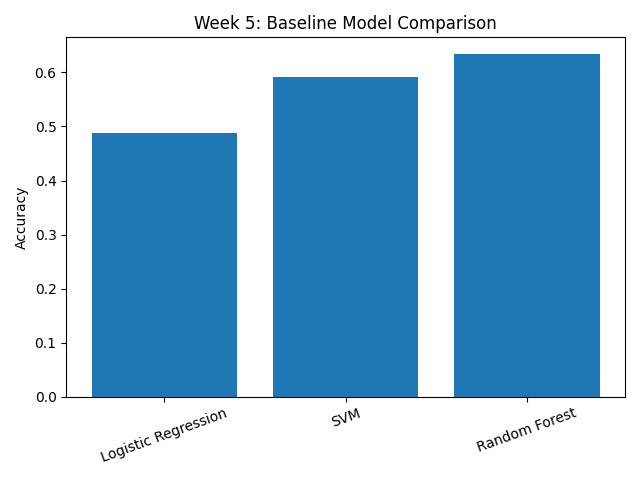
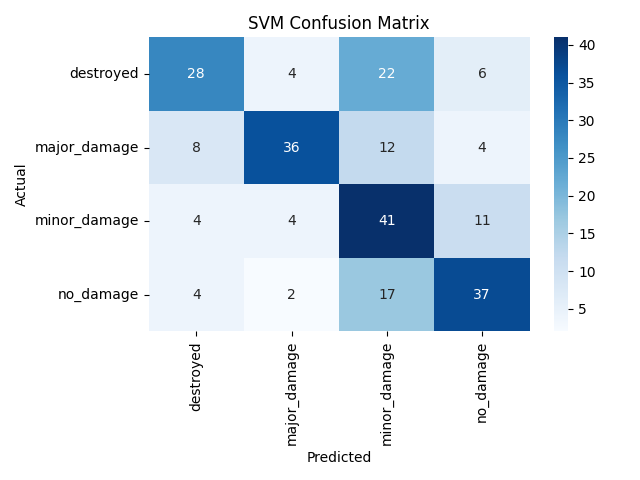
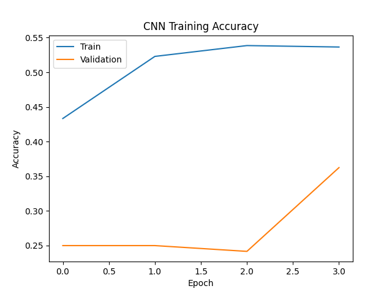
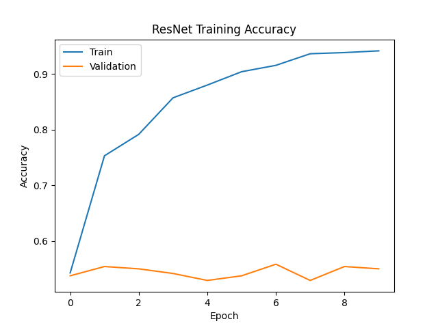
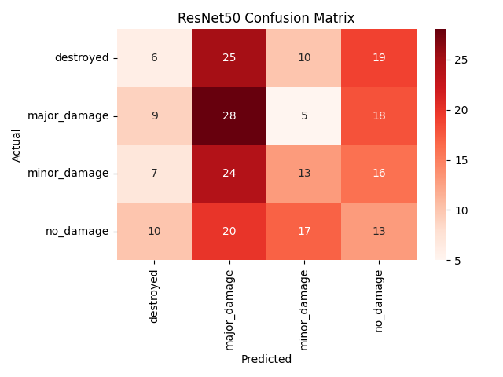

# Comparative Analysis of Machine Learning Models for Disaster Severity Classification

## 📌 Overview

This project presents a systematic comparative analysis of classical
Machine Learning (ML) and Deep Learning (DL) models for multi-class
disaster severity classification using satellite imagery from the xView2
dataset.

The study evaluates model performance under moderate dataset conditions
(1200 balanced building-level image crops) and investigates how dataset
scale influences deep learning generalization.

------------------------------------------------------------------------

## 🛰 Dataset

**Dataset Used:** xView2 Disaster Damage Assessment Dataset\
Official Source: https://xview2.org/dataset

### Classes:

-   No Damage
-   Minor Damage
-   Major Damage
-   Destroyed

### Dataset Preparation:

-   Building-level crop extraction using WKT polygon parsing
-   Image resizing (128×128)
-   Balanced dataset (300 samples per class)
-   80/20 Train-Validation split

Total samples used: **1200**

### Note:

The xView2 dataset is publicly available for research use and is governed by its original licensing terms.

------------------------------------------------------------------------

## 🧠 Models Implemented

### Classical Machine Learning:

-   Logistic Regression
-   Support Vector Machine (RBF Kernel)
-   Random Forest (100 estimators)

### Deep Learning:

-   Custom Convolutional Neural Network (CNN)
-   ResNet50 (Transfer Learning -- ImageNet Pretrained)

------------------------------------------------------------------------

## ⚙️ Experimental Setup

-   Language: Python
-   Libraries: Scikit-learn, TensorFlow/Keras, OpenCV, NumPy, Matplotlib
-   Hardware: AMD Ryzen 5 3500U, 16GB RAM (CPU-based training)
-   Evaluation Metrics:
    -   Accuracy
    -   Precision
    -   Recall
    -   F1-score
    -   Confusion Matrix

------------------------------------------------------------------------

## 📋 Performance Summary Table

| Model | Logistic Regression | Support Vector Machine (SVM) | Random Forest | Convolutional Neural Network (CNN) | ResNet50 (Transfer Learning) |
|-------|---------------------|------------------------------|---------------|------------------------------------|-------------------------------|
| **Feature Representation** | Flattened pixel vectors | Flattened pixel vectors | Flattened pixel vectors | Raw image tensors | Pretrained deep features |
| **Learning Type** | Linear classifier | Nonlinear classifier | Ensemble decision trees | Deep learning | Deep residual network |
| **Validation Accuracy** | 48.75% | 59.17% | 63.33% | 51.25% | 55.83% |
| **Strengths** | Simple, interpretable, fast training | Better nonlinear separation, stable | Robust, handles nonlinear interaction, resistant to overfitting | Automatic spatial feature learning | Strong hierarchical representation learning |
| **Weaknesses** | Cannot model nonlinear spatial patterns | Sensitive to parameter tuning | Less interpretable as ensemble grows | Overfitting under limited data | Data-hungry; overfitting observed |
| **Computational Complexity** | Very low | Moderate | Moderate | High | Very high |
| **Generalization Behavior** | Poor | Moderate | High | Moderate | Moderate |

------------------------------------------------------------------------

## 📊 Experimental Results

### 🔹 1. Final Model Accuracy Comparison



This figure presents the overall accuracy comparison across all implemented models. Random Forest achieved the highest classical ML performance, while deep learning models demonstrated competitive but dataset-sensitive behavior.

---

### 🔹 2. Week 5 – Classical ML Comparison



This comparison highlights the performance differences between Logistic Regression, SVM, and Random Forest. Tree-based methods exhibited stronger class discrimination capability compared to linear models.


---

### 🔹 3. Logistic Regression Confusion Matrix


The confusion matrix reveals moderate classification capability, with noticeable misclassification between minor and major damage classes due to linear decision boundaries.

---

### 🔹 4. Support Vector Machine Confusion Matrix



SVM demonstrates improved separation between structural damage levels compared to Logistic Regression, particularly in identifying minor and major damage categories.

---

### 🔹 5. Random Forest Confusion Matrix


Random Forest shows strong diagonal dominance, indicating robust multi-class performance and superior feature representation for structured damage classification.

---

### 🔹 6. Convolutional Neural Network (CNN) Accuracy Curve



The CNN training curve demonstrates gradual convergence with moderate validation accuracy. Slight divergence between training and validation suggests mild overfitting under limited dataset conditions.

---

### 🔹 7. ResNet50 Accuracy Curve



The transfer learning-based ResNet50 model shows rapid training convergence, though validation accuracy stabilizes at moderate levels, reflecting dataset size constraints and domain-specific complexity.

---

### 🔹 8. ResNet50 Confusion Matrix



The confusion matrix indicates deep feature extraction capability but also highlights inter-class ambiguity between damage severity levels, suggesting potential improvement through larger datasets and fine-tuning.

---

## 📈 Numerical Results (CSV File)

The complete evaluation metrics (accuracy, precision, recall, F1-score) are stored in:

📄 **[Download Final Model Comparison CSV](results/reports/final_model_comparison.csv)**

This structured file provides detailed quantitative comparison across all implemented models and supports reproducibility of experimental findings.

------------------------------------------------------------------------
## ⏱️ Runtime Comparison (CPU-Based Training)

| **Model Category** | **Training Time (seconds)** |
| -------------- | ----------------------- |
| Classical ML (LR + SVM + RF) | 330.36 |
| CNN (Optimized) | 62.49 |
| ResNet50 (Transfer Learning) | 260.1 |

The runtime analysis demonstrates that high-dimensional flattened feature vectors significantly increased computational cost for classical ML models. 

CNN exhibited efficient convergence due to structured convolution operations, while ResNet50 required higher processing time due t deep architecture complexity.

All experiments were conducted on AMD Ryzen 5 (CPU), 16GB RAM environment.

------------------------------------------------------------------------


## 🚀 How to Run

### Install Dependencies

```bash
pip install -r requirements.txt

### Run Baseline ML Models

python main_week5.py

### Run CNN Model

python main_week6.py

### Run ResNet50

python main_week8.py

### Generate Final Comparison Graph

python final_comparison.py
```
------------------------------------------------------------------------

## 👩‍💻 Author
### BTech Special Project - DSAI - 3rd year

**Student Name:** Md. Sadiya Tabassum

**Roll Number:** 23STUCHH010302

**Project Title:** Comparative Analysis of Machine Learning Models for Disaster Severity Classification

**Guide Name:** Dr. TLS Ramakrishna Sir

------------------------------------------------------------------------

## 📜 License

This repository is intended for academic and research use only.

The source code developed in this project may be used for educational and non-commercial research purposes.

The dataset used in this study (xView2 Disaster Damage Assessment Dataset) is subject to its original licensing terms and is not redistributed in this repository. Users must download the dataset directly from the official source: https://xview2.org/dataset
